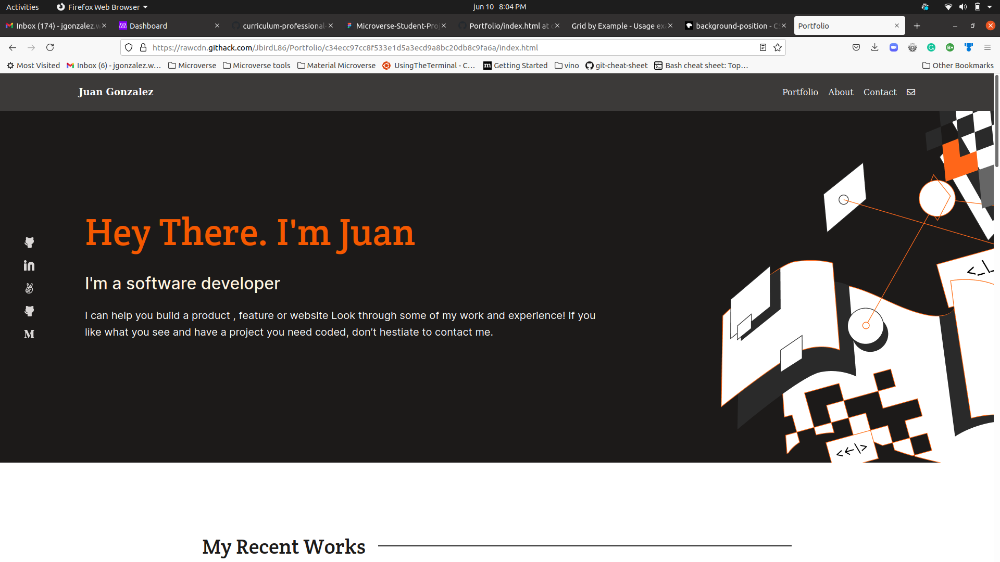

# Portfolio!

> Portfolio is a Microverse project where we get to build our own responsive portfolio by creating a webpage from a figma design template. This project will demostrate our knoledge using HTML and CSS but mostly some display properties such as flexbox, we'll also demostrate knowledge using the background property.

## Built With

- HTML
- CSS

## Online version

[Online Version Link](https://jbirdl86.github.io/Portfolio/)

## Authors

👤 **Author1**

Juan Gonzalez

- Github: [@githubhandle](https://github.com/JbirdL86)
- Twitter: [@twitterhandle](https://twitter.com/JuanLui06498455)
- Linkedin: [linkedin](https://www.linkedin.com/in/juan-luis-0551921aa/)

Juan Hernandez

- GitHub: [@githubhandle](https://github.com/jchernandez87)
- Twitter: [@twitterhandle](https://twitter.com/Juancar70771241)
- LinkedIn: [LinkedIn](https://www.linkedin.com/in/juan-carlos-hernandez-200a05175)

## 🤝 Contributing

Contributions, issues, and feature requests are welcome! Please leave a comment.

## Show your support

Give a ⭐️ if you like this project!

## Acknowledgments

- Microverse
- Inspiration
- Figma

## 📝 License

This project is [MIT](./MIT.md) licensed.